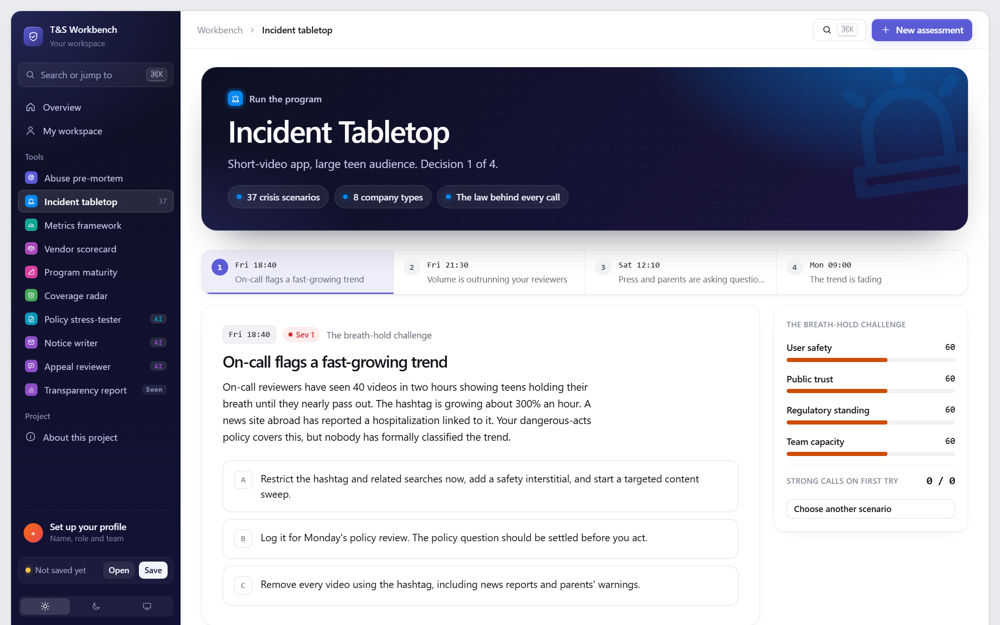
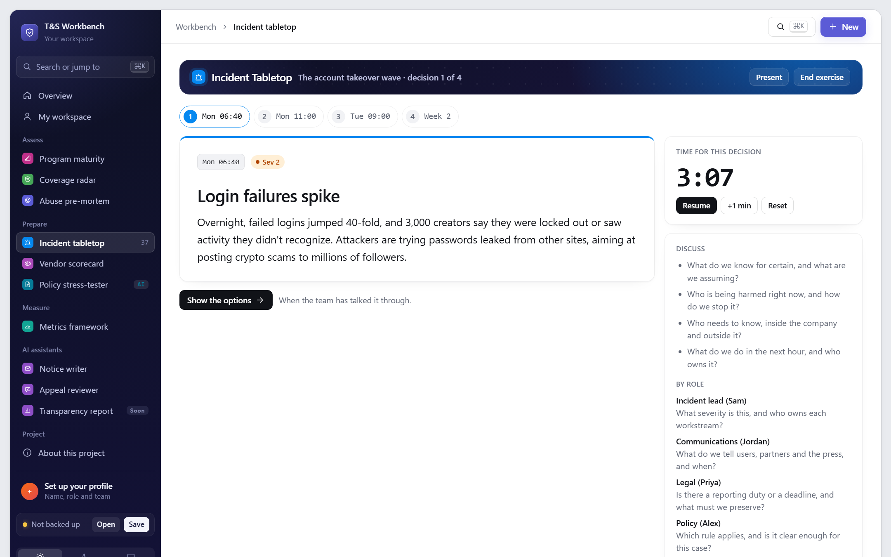
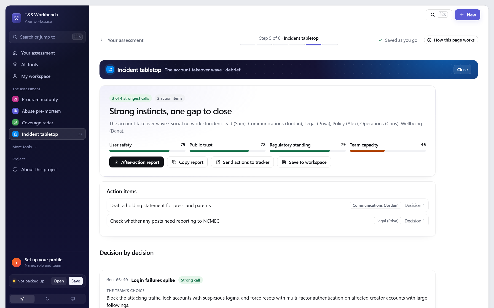
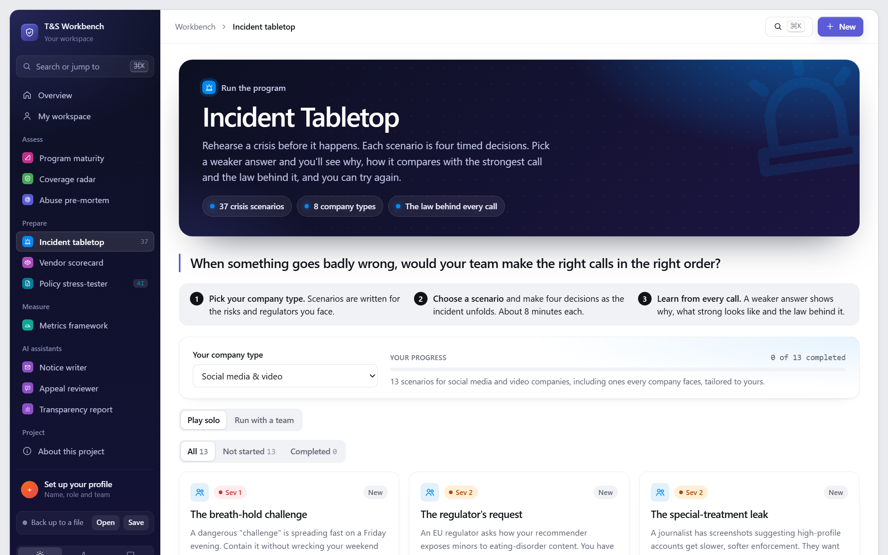

# Incident Tabletop

> **When something goes badly wrong, would your team make the right calls in the right order?**

43 crisis scenarios across 8 types of company. Make four timed decisions as each incident unfolds. Every weaker choice shows what happens next, what strong incident command looks like, and the law behind it. Play solo, or run it live with your team: roles, a timer for each decision, discussion prompts, a full-screen presenter view, and an after-action report with owned action items you can send to your tracker.

**[Try it live](https://stevenmacchia.com/ts-workbench/#tabletop)** · part of [T&S Workbench](https://github.com/stevenmacchia/ts-workbench) · free, no sign-up

## The problem

Teams write incident plans and never rehearse them, so the first real test is a live crisis with a regulator, a journalist and an exhausted on-call rotation. Tabletop exercises fix that, but they take days to design and facilitate.

## How it works

1. **Pick your company type.** Social, marketplace, fintech, gaming, dating, generative AI, gig economy or kids and education.
2. **Play a scenario.** Four timed decisions, scored on user safety, public trust, regulatory standing and team capacity.
3. **Learn from every call.** Weaker answers explain the consequence, the strongest call and the law, and you can retry.

## What's in this repo

The tool's knowledge, published as open content you can read, reuse and adapt.

| File | What it is |
|---|---|
| [`scenarios/`](scenarios/) | 43 scenarios (99 versions including tailored ones), each with every option, its consequence, the lesson and the law |
| [`data/scenarios.json`](data/scenarios.json) | All versions as JSON |

## Use it for

- Training new on-call and incident leads
- Leadership and cross-functional offsites
- Stress-testing an incident plan before a launch
- Interview exercises for T&S roles

## More screenshots

> **Not legal advice.** The law notes summarize obligations in plain language to help teams ask the right questions. Confirm with counsel before relying on them.

## License and credit

Content in this repo is licensed [CC BY 4.0](LICENSE): reuse and adapt it freely, with credit. The tool's source code is in [ts-workbench](https://github.com/stevenmacchia/ts-workbench) under the MIT license.

Built by [Steven Macchia](https://www.linkedin.com/in/stevenmacchia), Trust & Safety leader, with AI-assisted development (Claude).
